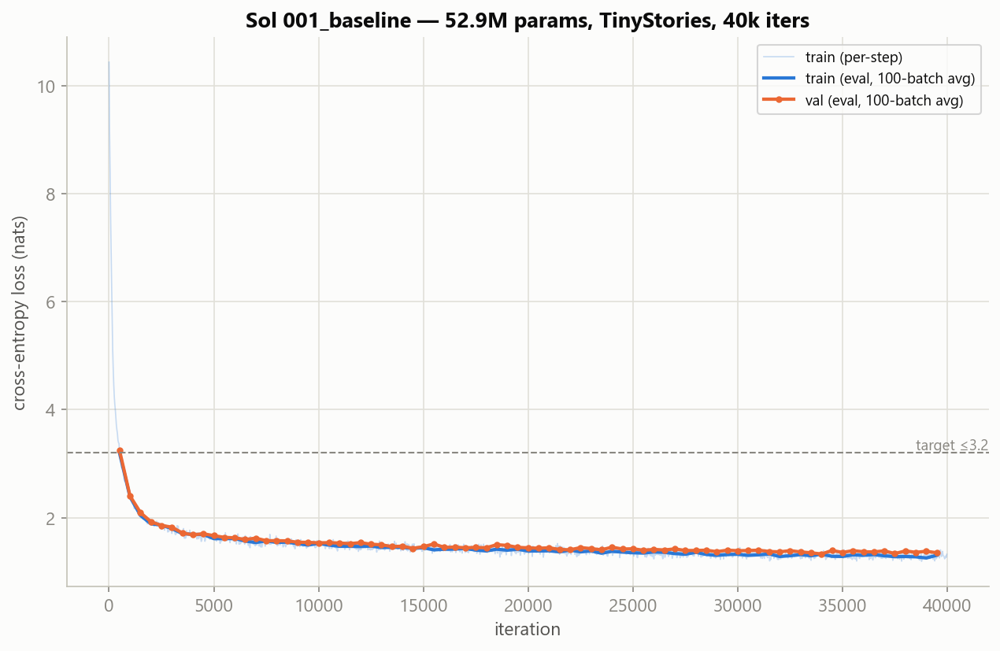

# Sol

A ~52M-parameter decoder-only transformer trained from scratch on TinyStories — data
pipeline, hand-written architecture, eval harness, ablations, and a deployed demo, all on
a single 8 GB laptop GPU.

**Hardware target:** NVIDIA GeForce RTX 4070 Laptop GPU (Ada Lovelace, sm_89, 8 GB) · BF16

## Status

✅ **M0–M7 complete**, **M8 code complete** — environment, data pipeline, EDA, model,
training loop, baseline run, evaluation harness, ablations, and the inference CLI +
Gradio demo are all done. **Sol-001: val perplexity 3.719, 95% CI [3.693, 3.745]** on
the full 15,141-document val set — vs a trigram baseline at 23.4 and a unigram baseline
at 379.0 (`eval/results.md`). `src/model.py` measures at **52,901,712 params**.
Ablations (M7): learning rate has by far the largest effect (20–200× seed-to-seed
noise); data scale (100M vs full corpus) matters, but only narrowly
(`experiments/002_lr_sweep/`, `experiments/003_data_scale/`,
`experiments/004_seed_variance/`). The public HF Space is not published yet — that is
the single open M8 item; the procedure is written out in [`docs/DEPLOY.md`](docs/DEPLOY.md).

See [`docs/DATA_CARD.md`](docs/DATA_CARD.md) for the full dataset writeup, including a
real bug caught and fixed mid-pipeline: validation's "28.67% duplicate rate" turned out
to be 0% internal duplication and 28.67% exact overlap with train (cross-split leakage,
now filtered) — a data-quality finding, not just a pipeline stat.

Full plan: [`docs/ROADMAP.md`](docs/ROADMAP.md) · Design rationale: [`docs/PROJECT.md`](docs/PROJECT.md) · Agent context: [`AGENTS.md`](AGENTS.md)

## Problem

Applied ML interviews reward candidates who understand tokenization, training dynamics,
and hardware trade-offs — not just API calls to foundation models. Sol is scoped to prove
those fundamentals end to end: a small model trained properly and measured honestly,
rather than a large one fine-tuned and demoed on vibes.

## Approach

| Component | Choice | Rationale |
|-----------|--------|-----------|
| Architecture | 8 layers, 8 heads, 592 embd, 512 context | **52.9M params, measured**; fits 8 GB comfortably (2344 MiB peak) without checkpointing |
| Vocab | 32k byte-level BPE, trained in-domain | Standard for small LMs; train-split only |
| Precision | **BF16** | Ada supports it — no GradScaler, no loss-scale debugging |
| Implementation | Hand-written `src/model.py` | The architecture code *is* the deliverable |
| Data | TinyStories, deduped, 357.85M-token cap (measured) | ~3.66 epochs at 40k iters |

**What gets measured:** validation perplexity with a bootstrap CI against three baselines
(uniform, unigram, trigram), an anchored 1–5 generation rubric scored blind, automatic
repetition metrics (distinct-2/3), and a seed-variance run so the ablations can be read
against real run-to-run noise.

## Results

Baseline run 001 (`experiments/001_baseline/`), evaluated on the full val set (M6):

| Metric | Original target | **Measured** |
|--------|--------|--------|
| Val perplexity | 15–25 | **3.719** [3.693, 3.745] (95% CI) |
| Peak VRAM | < 7400 MiB | **2344 MiB** |
| vs trigram baseline | beat it | **3.719 vs 23.4** |
| Rubric: grammar / coherence / repetition | — | **4.00 / 3.15 / 3.98** out of 5 (n=60) |
| Generation | Coherent short stories, some repetition | Grammatical; entity/character drift over ~150 tokens is the main flaw — see `docs/LIMITATIONS.md` |

Full breakdown, baselines table, per-length-bucket perplexity, and the qualitative
rubric: [`eval/results.md`](eval/results.md).



**Ablations (M7)**, all at a reduced 8000-iter budget with seed variance as the yardstick
(4.490 ± 0.0045 ppl across 3 seeds — n=3, so this range substitutes for a t-test rather
than pretending one is meaningful):

| Ablation | Result | vs seed-noise floor |
|---|---|---|
| Learning rate: 1e-4 / 3e-4 / 1e-3 | 5.380 / 4.489 / **4.162** ppl | 20–200× — real, large effect |
| Data scale: 100M vs full corpus | 4.572 / **4.489** ppl | 18× — real, but small (the milestone's honest negative result) |

Full writeups: [`experiments/002_lr_sweep/results.md`](experiments/002_lr_sweep/results.md),
[`experiments/003_data_scale/results.md`](experiments/003_data_scale/results.md),
[`experiments/004_seed_variance/results.md`](experiments/004_seed_variance/results.md).

## Try it

```powershell
python -m src.infer --prompt "Once upon a time, there was a little girl named Lily who" --seed 42
```

```powershell
python -m scripts.export_weights --out export/sol-001; $env:SOL_MODEL_DIR = "export/sol-001"; python app/demo.py
```

Generation stops at the model's own end-of-story token, streams, and is
reproducible per device: `--seed 42` twice gives byte-identical stdout. Measured
throughput: **~90 tok/s** on the 4070 (bf16), **21.6 tok/s** on CPU (fp32) — the
demo runs at the CPU number. Deployment procedure and the full cold-start
analysis: [`docs/DEPLOY.md`](docs/DEPLOY.md).

## How to run

```powershell
py -3.12 -m venv .venv
.\.venv\Scripts\pip.exe install torch==2.6.0 --index-url https://download.pytorch.org/whl/cu124
.\.venv\Scripts\pip.exe install -r requirements.txt
pytest
```

Full command reference: [`docs/COMMANDS.md`](docs/COMMANDS.md).

> The system Python here is 3.14, which has no PyTorch wheel — the 3.12 venv is required,
> and torch must come from the CUDA index or pip silently installs the CPU build.

## Repo layout

```text
sol/
├── configs/     # YAML training configs — single source of truth for every number
├── data/        # prepare.py, train_tokenizer.py, tokenize.py, eda.ipynb
├── src/         # config, model, train, eval, baselines, generate_samples, infer
├── eval/        # prompts.jsonl, generations.jsonl, rubric_scores.csv, results.md
├── experiments/ # benchmark + ablation runs and results
├── app/         # Gradio demo (deployed to a HF Space)
├── tests/       # env, config, tokenizer, data, model, training, eval
└── docs/        # ROADMAP, PROJECT, DATA_CARD, RUBRIC, LIMITATIONS
```

## What I'd do next

Tracked in [`docs/LIMITATIONS.md`](docs/LIMITATIONS.md) as results land. Top three right
now: (1) coherence — named entities drift across ~150-token generations, the binding
constraint per M6's rubric (3.15/5 vs 4.00/5 grammar); (2) a mojibake artifact inherited
from 6.2% of TinyStories' own training documents, confirmed by grepping the raw corpus,
not yet cleaned; (3) learned positional embeddings rather than RoPE, LayerNorm + GELU
rather than RMSNorm + SwiGLU — both real architecture trade-offs, not yet ablated.
